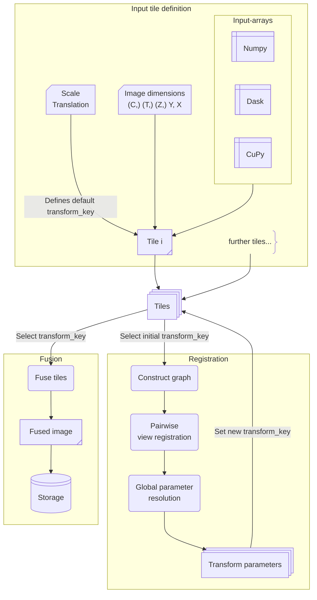
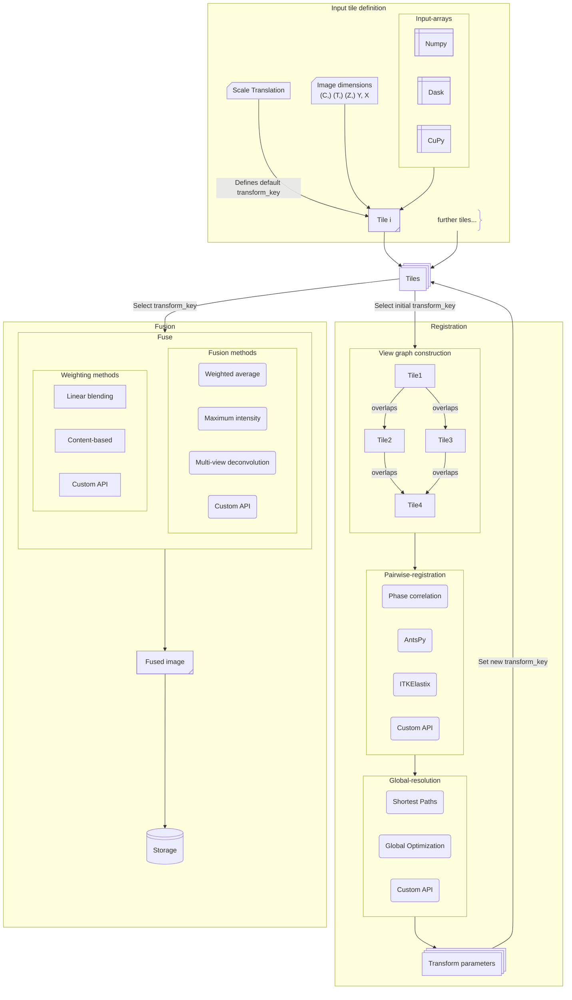

# Workflow chart

### Higher-level

```mermaid
%%{init: { "graph": { "htmlLabels": true, "curve": "linear" } } }%%
graph TD
%%   A[Numpy-like arrays] --> |Define geometry| B{Tiles};
  Tiles@{ shape: procs, label: "Tiles"}

  Tile_i@{ shape: tag-rect, label: "Tile i" }
  TileN@{ shape: brace-r, label: "further tiles..." }

  ArrayNP@{ shape: win-pane, label: "Numpy" }
  ArrayDA@{ shape: win-pane, label: "Dask" }
  ArrayCP@{ shape: win-pane, label: "CuPy" }

  Scale@{ shape: notch-rect, label: "Scale\n Translation" }
  Dimensions@{ shape: notch-rect, label: "Image dimensions\n(C,) (T,) (Z,) Y, X" }

  Fused@{ shape: tag-rect, label: "Fused image" }
  Fuse@{ shape: rounded, label: "Fuse tiles"}

  GraphConst@{ shape: rounded, label: "Construct graph" }
  PairReg@{ shape: rounded, label: "Pairwise\n view registration" }
  GloRes@{ shape: rounded, label: "Global parameter\n resolution" }
  Params@{ shape: procs, label: "Transform parameters"}

  Storage@{ shape: lin-cyl, label: "Storage" }

  Tile_i --> Tiles
%%   Tile2 --> Tiles
  TileN --> Tiles

  Tiles --> |Select initial transform_key| GraphConst
  Params --> |Set new transform_key| Tiles

  Tiles --> |Select transform_key| Fuse

  subgraph Input tile definition
    subgraph Input-arrays
        ArrayNP
        ArrayDA
        ArrayCP
    end
    Input-arrays --> Tile_i
    Scale --> |Defines default transform_key| Tile_i
    Dimensions --> Tile_i
    %% Array2 --> Tile1
    %% Scale2 --> Tile2
    TileN
  end

  subgraph Registration
  GraphConst --> PairReg
  PairReg --> GloRes
  GloRes --> Params
  end

  subgraph Fusion
    Fuse --> Fused
    Fused --> Storage
  end
```

### Lower-level

```mermaid
graph TD
%%   A[Numpy-like arrays] --> |Define geometry| B{Tiles};
  Tiles@{ shape: procs, label: "Tiles"}

  Tile_i@{ shape: tag-rect, label: "Tile i" }
  TileN@{ shape: brace-r, label: "further tiles..." }

  ArrayNP@{ shape: win-pane, label: "Numpy" }
  ArrayDA@{ shape: win-pane, label: "Dask" }
  ArrayCP@{ shape: win-pane, label: "CuPy" }

  Scale@{ shape: notch-rect, label: "Scale Translation" }
  Dimensions@{ shape: notch-rect, label: "Image dimensions\n(C,) (T,) (Z,) Y, X" }

  Fused@{ shape: tag-rect, label: "Fused image" }
  Fuse@{ shape: circle, label: "Fuse tiles"}

%%   Fusion-methods@{ shape: brace-r, label: "**Fusion methods**
%%     - weighted average
%%     - multi-view deconvolution
%%     - custom API
%% " }

  Weighted_average@{ shape: rounded, label: "Weighted average" }
  Max_fusion@{ shape: rounded, label: "Maximum intensity" }
  Multi-view-deconvolution@{ shape: rounded, label: "Multi-view deconvolution" }
  Custom-fusion@{ shape: rounded, label: "Custom API" }

  Blending_weights@{ shape: rect, label: "Linear blending" }
  Content_weights@{ shape: rect, label: "Content-based" }
  Custom_weights@{ shape: rect, label: "Custom API" }

  subgraph Graph-construction["View graph construction"]
  direction TB
    Tile1 --> |overlaps| Tile2 & Tile3--> |overlaps| Tile4
  end

  subgraph Pairwise-registration
    direction RL
    RegPhase@{ shape: rounded, label: "Phase correlation" }
    RegAnts@{ shape: rounded, label: "AntsPy" }
    RegElastix@{ shape: rounded, label: "ITKElastix" }
    RegCustom@{ shape: rounded, label: "Custom API" }
  end

  subgraph Global-resolution
    direction RL
    GloRes_shortest@{ shape: rounded, label: "Shortest Paths" }
    GloRes_globalopt@{ shape: rounded, label: "Global Optimization" }
    GloRes_custom@{ shape: rounded, label: "Custom API" }
  end

  Params@{ shape: procs, label: "Transform parameters"}

  Storage@{ shape: lin-cyl, label: "Storage" }

  Tile_i --> Tiles
  TileN --> Tiles

  Tiles --> |Select initial transform_key| Graph-construction
  Params --> |Set new transform_key| Tiles

  Tiles --> |Select transform_key| Fuse

  subgraph Input tile definition
    subgraph Input-arrays
        ArrayNP
        ArrayDA
        ArrayCP
    end
    Input-arrays --> Tile_i
    Scale --> |Defines default transform_key| Tile_i
    Dimensions --> Tile_i
    TileN
  end

  subgraph Registration
  Graph-construction --> Pairwise-registration
  Pairwise-registration --> Global-resolution
  Global-resolution --> Params
  end

  subgraph Fusion
    direction LR

  subgraph Fuse

    direction TB

    subgraph Fusion-methods[Fusion methods]
      direction RL
      Weighted_average
      Max_fusion
      Multi-view-deconvolution
      Custom-fusion
    end

    subgraph Weighting-methods[Weighting methods]
      direction RL
      Blending_weights
      Content_weights
      Custom_weights
    end

    end

    Fuse --> Fused
    Fused --> Storage
  end
```
