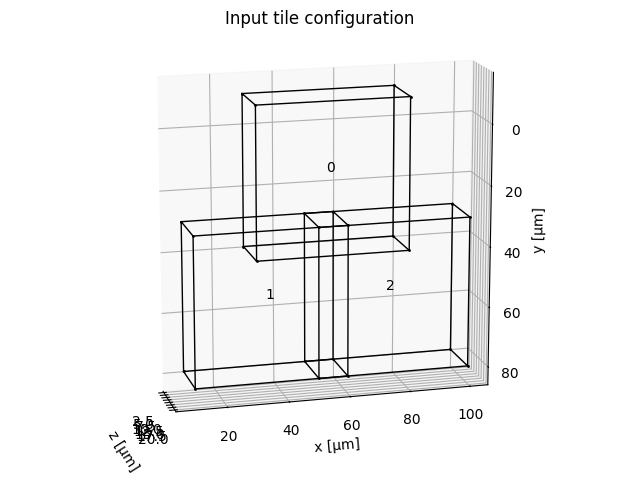
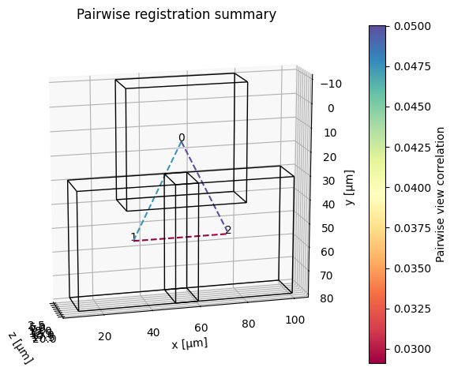
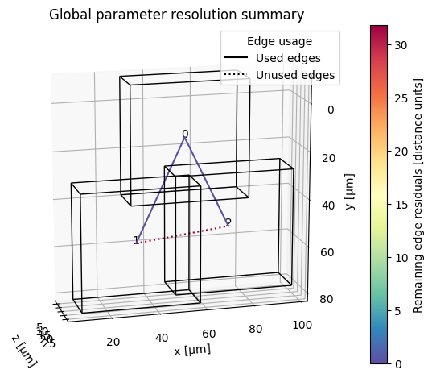

# Code example

These code snippets walk you through a small stitching workflow consisting of

  1. Preparing the input image data and metadata (tile positions, spacing, channels)
  2. Registering the tiles
  3. Stitching / fusing the tiles

Make sure to also check out the [example notebooks](https://github.com/multiview-stitcher/multiview-stitcher/tree/main/notebooks). in the `notebooks/` directory.

Note that the code snippets are minimal examples and the tile boundaries shown in the visualizations contain random image data.

#### 1) Prepare data for stitching


```python
import numpy as np
from multiview_stitcher import msi_utils
from multiview_stitcher import spatial_image_utils as si_utils

# input data (can be any numpy compatible array: numpy, dask, cupy, etc.)
tile_arrays = [np.random.randint(0, 100, (2, 10, 100, 100)) for _ in range(3)]

# indicate the tile offsets and spacing
tile_translations = [
    {"z": 2.5, "y": -10, "x": 30},
    {"z": 2.5, "y": 30, "x": 10},
    {"z": 2.5, "y": 30, "x": 50},
]
spacing = {"z": 2, "y": 0.5, "x": 0.5}

channels = ["DAPI", "GFP"]

# build input for stitching
msims = []
for tile_array, tile_translation in zip(tile_arrays, tile_translations):
    sim = si_utils.get_sim_from_array(
        tile_array,
        dims=["c", "z", "y", "x"],
        scale=spacing,
        translation=tile_translation,
        # affine=None, # (e.g. for rotated or sheared tiles)
        transform_key="stage_metadata",
        c_coords=channels,
    )
    msims.append(msi_utils.get_msim_from_sim(sim, scale_factors=[]))

# plot the tile configuration
# from multiview_stitcher import vis_utils
# fig, ax = vis_utils.plot_positions(msims, transform_key='stage_metadata', use_positional_colors=False)
```



#### 2) Register the tiles

```python
from dask.diagnostics import ProgressBar
from multiview_stitcher import registration

with ProgressBar():
    params = registration.register(
        msims,
        reg_channel="DAPI",  # channel to use for registration
        transform_key="stage_metadata",
        new_transform_key="translation_registered",
        pre_registration_pruning_method=None,
        plot_summary=True,
    )
```





#### 3) Stitch / fuse the tiles
```python
from multiview_stitcher import fusion

fused_msim = fusion.fuse(
    images=msims,
    transform_key="translation_registered",
)

# get fused array at the highest output resolution as a dask array
fused_msim["scale0/image"].data

# get fused array at the highest output resolution as a numpy array
fused_msim["scale0/image"].data.compute()
```

Because the input is a list of `MultiscaleSpatialImage` objects, lazy fusion returns a fused `MultiscaleSpatialImage`.

For large datasets (>50GB, potentially with benefits already at >5GB) consider streaming the fused result directly to a zarr file using the following way to call `fusion.fuse`:

```python
from multiview_stitcher import fusion

fused_sim = fusion.fuse(
    images=msims,
    transform_key="translation_registered",
    # ... further optional args for fusion.fuse
    output_zarr_url="fused_output.ome.zarr",
    zarr_options={
        "ome_zarr": True,
        # "ngff_version": "0.4",  # optional
    },
    # optionally, we can use joblib for parallelization (`pip install joblib` and `from multiview_stitcher import misc_utils`):
    # batch_options={
    #     "batch_func": misc_utils.process_batch_using_joblib,
    #     "n_batch": 20,  # number of chunk fusions to schedule / submit at a time
    #     "batch_func_kwargs": {
    #         'n_jobs': 4  # number of parallel jobs for joblib
    #     },
    # },
)
```
