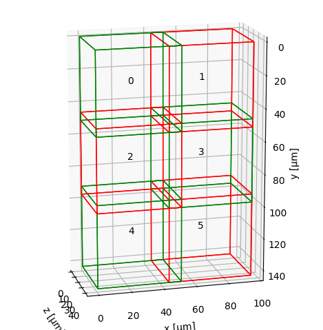

# Defining input data

This section explains how to load our image data and pre-position input tiles / views in physical space just like the following example:



Before registering or fusing our dataset, we need to represent each view or tile as a `MultiscaleSpatialImage` — the core data structure of multiview-stitcher. Basically, this is a numpy-like array that also carries spatial metadata (axis labels, pixel spacing, origin, and affine transforms).

This page explains what that structure looks like, how to build it from arrays or files, and how spatial metadata is stored.

---

## Core data structures

### `SpatialImage` (sim)

A `SpatialImage` is an [`xarray.DataArray`](https://docs.xarray.dev/en/stable/) subclass that carries image data together with pixel spacing, origin coordinates, and one or more named affine transforms (stored under `sim.attrs["transforms"]`). Dimensions follow the convention `(t, c, z, y, x)` — any subset is valid. Each named transform is addressed by its `transform_key`.

### `MultiscaleSpatialImage` (msim)

A `MultiscaleSpatialImage` is a [`DataTree`](https://datatree.readthedocs.io/) that wraps one or more resolution levels (`scale0`, `scale1`, …). Each scale contains:

- an `image` data variable — the pixel data as a (lazy) dask array
- one or more **transform** data variables — one per named coordinate system (`transform_key`)

```
DataTree('None', parent=None)
├── DataTree('scale0')
│       Data variables:
│           affine_metadata  (t, x_in, x_out) float64   ← transform (transform_key="affine_metadata")
│           image            (t, c, z, y, x)  uint16    ← pixel data
├── DataTree('scale1')
│       ...
```

!!! note "sim vs msim: which does each function expect?"
    Some functions (e.g. `fusion.fuse`) take a list of `SpatialImage` (sim), while others (e.g. `registration.register`) take a list of `MultiscaleSpatialImage` (msim). Converting between the two is straightforward:

    ```python
    sim  = msi_utils.get_sim_from_msim(msim)   # extract scale0 SpatialImage from an msim
    msim = msi_utils.get_msim_from_sim(sim, scale_factors=[])  # wrap a sim as an msim
    ```

    When we only need the highest resolution, either representation is equivalent and we can convert freely. If we want to make use of multiple resolution levels (e.g. for faster registration at lower res), we load or build an `msim` with several scales — the best way is to read it directly from OME-Zarr (see [Reading from OME-Zarr](#reading-from-ome-zarr)).

---

## Coordinate systems and `transform_key`

Every affine transform attached to a view has a **name** called `transform_key`. This lets us store multiple coordinate systems on the same image without confusion — for example:

| `transform_key`          | Meaning |
|--------------------------|---------|
| `"stage_metadata"`       | Raw tile positions from the microscope stage |
| `"translation_registered"` | Positions after registration |
| `"affine_metadata"` (default) | Pixel-spacing / origin only (identity rotation) |

We pass `transform_key` to both `registration.register()` and `fusion.fuse()` to tell them which coordinate system to use.

!!! tip
    Use a descriptive `transform_key` for each processing step. The original stage positions are never overwritten — we can always fall back to them.

---

## Building input from NumPy / Dask arrays

Use `si_utils.get_sim_from_array` to wrap any array as a `SpatialImage`, then `msi_utils.get_msim_from_sim` to turn it into a `MultiscaleSpatialImage`:

```python
import numpy as np
from multiview_stitcher import msi_utils
from multiview_stitcher import spatial_image_utils as si_utils

tile_array = np.random.randint(0, 1000, (2, 50, 512, 512), dtype=np.uint16)

sim = si_utils.get_sim_from_array(
    tile_array,
    dims=["c", "z", "y", "x"],   # dimension labels
    scale={"z": 2.0, "y": 0.5, "x": 0.5},          # pixel spacing in physical units
    translation={"z": 0.0, "y": 100.0, "x": 200.0}, # origin / tile offset
    transform_key="stage_metadata",
    c_coords=["DAPI", "GFP"],    # optional channel names
)

# wrap in a MultiscaleSpatialImage (required by registration.register)
msim = msi_utils.get_msim_from_sim(sim, scale_factors=[])
```

**Key parameters of `get_sim_from_array`:**

| Parameter | Description |
|-----------|-------------|
| `array` | Any NumPy-compatible array (numpy, dask, cupy, …) |
| `dims` | Ordered dimension labels — any subset of `['t', 'c', 'z', 'y', 'x']` |
| `scale` | Pixel spacing per spatial dimension, e.g. `{"z": 2.0, "y": 0.5, "x": 0.5}` |
| `translation` | Physical-space origin (lower-left corner) of the tile |
| `affine` | Optional full affine matrix (overrides `scale`/`translation`). Useful for rotated or sheared tiles. |
| `transform_key` | Name of the coordinate system to store the transform under |
| `c_coords` | Channel names, e.g. `["DAPI", "GFP"]` |
| `t_coords` | Time-point labels, e.g. `[0.0, 0.5, 1.0]` |

!!! note "Affine transforms for rotated tiles"
    If our tiles are rotated or sheared (e.g. light-sheet multi-view data), pass the full homogeneous affine matrix via `affine=` instead of `scale` + `translation`. The matrix maps coordinates in "physical image coordinates" (scale/spacing and translation/origin already applied) to physical coordinates.

---

## Putting it all together

A minimal end-to-end data loading snippet for a 3-tile 2-D dataset:

```python
import numpy as np
from multiview_stitcher import msi_utils
from multiview_stitcher import spatial_image_utils as si_utils

tile_arrays = [np.random.randint(0, 100, (2, 512, 512)) for _ in range(3)]

tile_translations = [
    {"y": 0,   "x": 0},
    {"y": 0,   "x": 450},
    {"y": 0,   "x": 900},
]
spacing = {"y": 0.5, "x": 0.5}

msims = []
for arr, translation in zip(tile_arrays, tile_translations):
    sim = si_utils.get_sim_from_array(
        arr,
        dims=["c", "y", "x"],
        scale=spacing,
        translation=translation,
        transform_key="stage_metadata",
        c_coords=["DAPI", "GFP"],
    )
    msims.append(msi_utils.get_msim_from_sim(sim, scale_factors=[2]))
```

The resulting `msims` list is the direct input to `registration.register` and `fusion.fuse`. We can sanity-check the tile layout before proceeding:

```python
from multiview_stitcher import vis_utils

fig, ax = vis_utils.plot_positions(msims, transform_key="stage_metadata", use_positional_colors=False)
```


Continue to the [Registration overview](registration_overview.md) for the next step.

---

## Reading from OME-Zarr

`ngff_utils` provides two helpers to read OME-Zarr files (NGFF v0.4 / v0.5):

```python
from multiview_stitcher import ngff_utils

# Read all resolution levels → MultiscaleSpatialImage
msim = ngff_utils.read_msim_from_ome_zarr("my_tile.ome.zarr", transform_key="stage_metadata")

# Read a single resolution level → SpatialImage
sim = ngff_utils.read_sim_from_ome_zarr("my_tile.ome.zarr", resolution_level=0, transform_key="stage_metadata")
```

!!! note
    OME-Zarr versions 0.4 and 0.5 do not store affine transforms, so the loaded image will have an identity transform set for the given `transform_key`. Set the correct tile/view transforms via `msi_utils.set_affine_transform` (or `si_utils.set_affine_transform` for `SpatialImage`) before registration or fusion.

---

## Reading tiles from OME-TIFF

[`ome-types`](https://ome-types.readthedocs.io/) (`pip install ome-types`) extracts per-tile positions and pixel spacing from the embedded OME-XML metadata. Pixel data is loaded **lazily** via `dask.delayed` so that only the tiles actually needed are read from disk:

```python
import numpy as np
import dask.array as da
from dask import delayed
import tifffile
import ome_types
from multiview_stitcher import msi_utils
from multiview_stitcher import spatial_image_utils as si_utils

filepath = "my_dataset.ome.tiff"
ome_metadata = ome_types.from_tiff(filepath)
sdims = ["y", "x"]  # adjust to ["z", "y", "x"] for 3-D data

msims = []
for itile, image in enumerate(ome_metadata.images):
    pixels = image.pixels
    spacing     = {dim: getattr(pixels, f"physical_size_{dim}") for dim in sdims}
    translation = {dim: pixels.planes[0].__dict__[f"position_{dim}"] for dim in sdims}
    shape       = {dim: getattr(pixels, f"size_{dim}") for dim in sdims}
    dtype       = np.dtype(pixels.type.value)

    # lazy load — actual file I/O deferred until compute() is called
    data = da.from_delayed(
        delayed(tifffile.imread)(filepath, series=itile),
        shape=[shape[dim] for dim in sdims],
        dtype=dtype,
    )

    sim = si_utils.get_sim_from_array(
        data,
        dims=sdims, # add channel dimension here if present
        scale=spacing,
        translation=translation,
        transform_key="stage_metadata",
    )
    msims.append(msi_utils.get_msim_from_sim(sim, scale_factors=[]))
```

See the [example notebook](https://github.com/multiview-stitcher/multiview-stitcher/blob/main/notebooks/stitch_and_register_ashlar_example_dataset.ipynb) for a full worked example with multi-cycle OME-TIFF data.