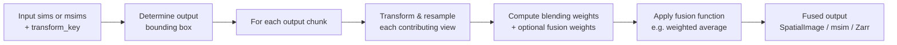

# Fusion overview

Fusion combines all registered views / tiles into a fused output image.
`fusion.fuse` is the main entry point.

---

## High-level workflow



1. **Determine output bounding box** — from the union (or intersection) of all view extents in the registered coordinate system.
2. **Chunk-wise processing** — the output is split into spatial chunks, processed independently and lazily via Dask.
3. **Transform & resample** — each view is interpolated into the output coordinate system at the resolution specified by `output_spacing`.
4. **Blending weights** — smooth cosine-falloff weights are computed near tile boundaries to avoid hard edges.
5. **Fusion function** — combines the resampled views (and optional per-view content weights) into a single pixel value.

---

## Minimal example

```python
from multiview_stitcher import fusion

fused_msim = fusion.fuse(
    images=msims,
    transform_key="translation_registered",
)

# lazy dask array at the highest output resolution
fused_msim["scale0/image"].data

# trigger compute
fused_msim["scale0/image"].data.compute()
```

---

## Key parameters

| Parameter | Default | Description |
|-----------|---------|-------------|
| `images` | — | List of inputs. All entries must be either `SpatialImage` (`sim`) or `MultiscaleSpatialImage` (`msim`). |
| `transform_key` | `None` | Which registered coordinate system to fuse in |
| `fusion_func` | `weighted_average_fusion` | Function that merges the resampled views |
| `fusion_func_kwargs` | `None` | Extra arguments forwarded to `fusion_func` |
| `weights_func` | `None` | Optional function to compute per-view content-based weights |
| `weights_func_kwargs` | `None` | Extra arguments forwarded to `weights_func` |
| `output_spacing` | `None` | Physical spacing of the output image per dimension, e.g. `{"z": 1.0, "y": 0.5, "x": 0.5}`. Defaults to the input spacing. |
| `output_stack_mode` | `"union"` | Output bounding box: `"union"` (covers all tiles), `"intersection"` (only the common area), `"sample"` |
| `output_origin` | `None` | Override the physical origin of the output bounding box |
| `output_shape` | `None` | Override the pixel shape of the output bounding box |
| `output_chunksize` | `None` | Dask chunk size for the output array. Defaults to the input tile chunksize. |
| `interpolation_order` | `1` | Spline interpolation order used when resampling views (0 = nearest, 1 = linear, 3 = cubic) |
| `blending_widths` | `None` | Width of the cosine blending zone near tile boundaries, in physical units per dimension |
| `output_zarr_url` | `None` | If set, fuse directly to a Zarr store and return a store-backed `SpatialImage` (recommended for large datasets) |
| `zarr_options` | `None` | Options for Zarr output (see below) |
| `batch_options` | `None` | Options for parallel batch processing of chunks when `output_zarr_url` is set |

---

## SpatialImage vs MultiscaleSpatialImage inputs

`fusion.fuse` accepts either a list of `SpatialImage` objects (`sim`) or a
list of `MultiscaleSpatialImage` objects (`msim`). Do not mix the two in one
call.

- If the input is a list of `sim` objects, lazy fusion returns one fused
  `SpatialImage`.
- If the input is a list of `msim` objects and `output_zarr_url` is not set,
  lazy fusion returns a fused `MultiscaleSpatialImage`. Output resolution
  levels are calculated with `msi_utils.calc_resolution_levels`, and each
  output level is fused from the coarsest input level that is still fine enough
  for that output spacing.
- If `output_zarr_url` is set, fusion streams one output image to disk and
    returns a store-backed `SpatialImage`. For `msim` inputs, the input level is
    selected from the requested output spacing, and the returned object remains
    a `MultiscaleSpatialImage`: when writing OME-Zarr
    (`zarr_options={"ome_zarr": True}`), it is the written multiscale image;
    otherwise it is a single-scale multiscale wrapper around the written Zarr-backed
    output image.

Use `msi_utils.get_sim_from_msim(msim, scale="scale0")` only when you
explicitly want to force fusion from one resolution level.

---

## Fusion methods

Pass a fusion function via `fusion_func`:

| Function | Best for |
|----------|----------|
| `weighted_average_fusion` (default) | Smooth, general-purpose blending across overlaps |
| `simple_average_fusion` | Baseline averaging without blending weights |
| `max_fusion` | Sparse or bright features where maximum intensity is desired |
| `multi_view_deconvolution` | Multi-view light-sheet data |

See [Built-in fusion methods](built_in_methods_fusion.md) for full parameter reference.

---

## Blending weights

Smooth cosine-falloff blending weights are automatically applied near tile edges to avoid hard seams. Control the transition zone width (in physical units) via `blending_widths`:

```python
fused_sim = fusion.fuse(
    images=sims,
    transform_key="translation_registered",
    blending_widths={"z": 10.0, "y": 20.0, "x": 20.0},
)
```

See [Built-in fusion methods](built_in_methods_fusion.md) for details on weight normalisation.

---

## Content-based fusion weights

For multi-view fluorescence data, content-based weights up-weight regions with high local contrast. Enable them via `weights_func`:

```python
from multiview_stitcher import fusion, weights

fused_sim = fusion.fuse(
    images=sims,
    transform_key="translation_registered",
    weights_func=weights.content_based,
    weights_func_kwargs={"sigma_1": 3, "sigma_2": 6},
)
```

---

## Controlling output resolution and extent

```python
fused_sim = fusion.fuse(
    images=sims,
    transform_key="translation_registered",
    output_spacing={"z": 2.0, "y": 0.5, "x": 0.5},  # isotropic XY, 4× coarser Z
    output_stack_mode="union",   # cover all tiles
)
```

To crop the output to a specific region, pass `output_origin` + `output_shape` (or `output_stack_properties`):

```python
fused_sim = fusion.fuse(
    images=sims,
    transform_key="translation_registered",
    output_origin={"z": 0, "y": 100.0, "x": 100.0},
    output_shape={"z": 50, "y": 512, "x": 512},
)
```

---

## Writing large datasets directly to (OME-Zarr)

For huge datasets, stream the fused output directly to a Zarr store. Each chunk is fused and written independently — successfully tested on datasets up to ~0.5 PB:

```python
fused_sim = fusion.fuse(
    images=msims,
    transform_key="translation_registered",
    output_zarr_url="fused_output.ome.zarr",
    zarr_options={
        "ome_zarr": True,
        # "ngff_version": "0.4",  # optional, default "0.4"
    },
)
```

### Parallel batch processing with joblib

Process multiple chunks in parallel using `joblib` (`pip install joblib`):

```python
from multiview_stitcher import misc_utils

fused_sim = fusion.fuse(
    images=msims,
    transform_key="translation_registered",
    output_zarr_url="fused_output.ome.zarr",
    zarr_options={"ome_zarr": True},
    batch_options={
        "batch_func": misc_utils.process_batch_using_joblib,
        "n_batch": 20,
        "batch_func_kwargs": {"n_jobs": 4},
    },
)
```

---

## GPU acceleration

Pass `use_cupy=True` to run resampling, blending weight calculation and fusion on the GPU.

```python
fused_sim = fusion.fuse(
    images=sims,
    transform_key="translation_registered",
    use_cupy=True,
)
```

See [GPU support](gpu_support.md) for setup instructions.

---

## Next steps

- **Multi-view deconvolution** → [Built-in fusion methods](built_in_methods_fusion.md)
- **Custom fusion function** → [Extension API: fusion](extension_api_fusion.md)
- **Troubleshoot fusion issues** → [Fusion troubleshooting](troubleshoot_fusion.md)
- **Visualize the result** → [neuroglancer](neuroglancer.md) or [napari](napari_stitcher.md)
