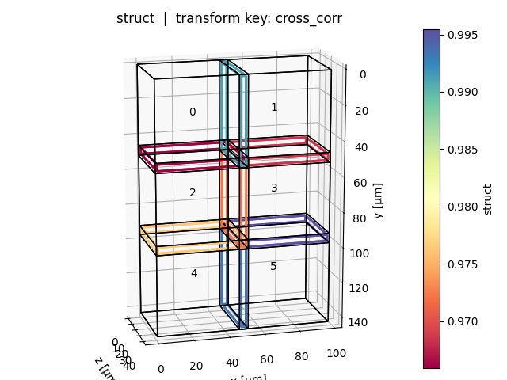
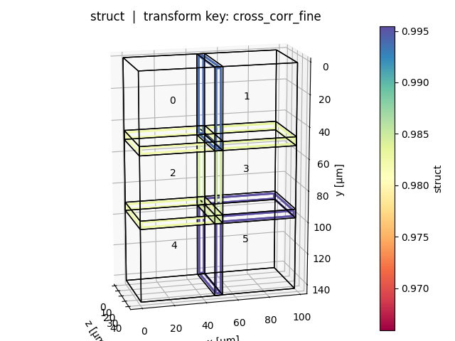
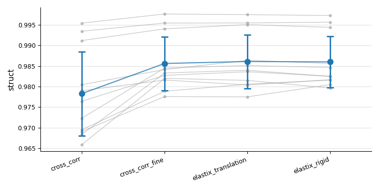

# Registration quality metrics

After running registration it is useful to verify *how much better* (or worse) a given transform key actually aligns the tiles compared to the initial positions.
`multiview_stitcher.metrics` provides two functions for this purpose:

| Function | Purpose |
|---|---|
| `metrics.tile_pair_image_metrics` | Compute image similarity metrics in the overlap region for every adjacent tile pair – supports two modes (see below) |
| `vis_utils.plot_tile_pair_image_metrics` | Visualise the results as a positional tile graph and/or a summary overview plot |

### Two modes

`tile_pair_image_metrics` accepts **exactly one** of:

- **`query_transform_keys`** *(Mode 1)* — pairs are derived automatically from spatial overlap; metrics are evaluated under each named transform key, enabling side-by-side comparison (e.g. stage position vs. registered).
- **`pairs_graph`** *(Mode 2)* — pairs and their transforms are taken directly from a pre-computed pairwise registration graph (e.g. `g_reg_computed` from `registration.compute_pairwise_registrations`). Each edge contributes one candidate. Useful for quality assessment and pair filtering between the pairwise and global resolution steps. `base_transform_key` is still required: it defines the overlap geometry and is used to convert each world-space edge transform into the intrinsic sampling convention (`p_moving = inv(T_moving_base) @ T_edge @ T_fixed_base`).

---

## How it works (Mode 1)

The steps below apply to **Mode 1** (`query_transform_keys`). In **Mode 2** the pair list and candidate transforms come from the supplied `pairs_graph`; the overlap geometry and sampling steps (2–4) are identical.

### 1 – Overlap region (`base_transform_key`)

For each adjacent tile pair the overlap bounding box is computed in the world coordinate system defined by `base_transform_key`.
An optional `max_tolerance` shrinks this box on every side, ensuring the comparison region stays fully inside both tiles even if the query transform deviates from the base by up to that physical distance.

### 2 – Fixed image in intrinsic space

The bounding box is projected into the **intrinsic (physical) space of the fixed tile** via `inv(T_fixed_base)`.
The fixed tile is always sampled with an identity transform, guaranteeing that exactly the same pixels contribute to the comparison regardless of which query key is being evaluated.

### 3 – Moving image under each query transform

For each `query_transform_key` the moving tile is resampled as:

$$
p_\text{moving} = T_\text{moving,q}^{-1} \cdot T_\text{fixed,q}
$$

This means the relative placement of fixed and moving tiles reflects purely the *query* transforms, making metric values directly comparable across keys.

### 4 – Metric functions

Any callable with signature `func(im1: np.ndarray, im2: np.ndarray) -> float` can be used.
NaN pixels (outside the image domain after resampling) are handled by the built-in `normalized_cross_correlation`; third-party metrics (e.g. from `skimage.metrics`) should be wrapped with `functools.partial` if extra arguments are needed.

---

## Usage example

### Mode 1 – compare multiple transform keys

```python
import functools
import skimage.metrics
from multiview_stitcher import metrics, vis_utils

# --- compute metrics ---
metrics_result = metrics.tile_pair_image_metrics(
    msims,
    base_transform_key='cross_corr',        # defines overlap region
    query_transform_keys=[
        'cross_corr',
        'elastix_translation',
        'elastix_rigid',
    ],
    metric_funcs={
        'ncc':    metrics.normalized_cross_correlation,
        'struct': functools.partial(
            skimage.metrics.structural_similarity,
            data_range=1000,
        ),
    },
    max_tolerance=1,   # shrink comparison box by 1 physical unit on each side
)

# --- visualise (works with both modes) ---
vis_utils.plot_tile_pair_image_metrics(
    msims,
    metrics_result,
    base_transform_key='cross_corr',
    metric_key='struct',                    # which metric to colour-code
    query_transform_keys=[
        'cross_corr',
        'elastix_translation',
        'elastix_rigid',
    ],
    show_plot_positions=True,   # tile graph coloured by metric value per query key
    show_overview_plot=True,    # summary: per-pair lines + mean ± std across keys
)
```

### Mode 2 – evaluate a pre-computed registration graph

```python
from multiview_stitcher import metrics, registration

# g_reg_computed is the output of registration.compute_pairwise_registrations()
metrics_result = metrics.tile_pair_image_metrics(
    msims,
    base_transform_key='affine_metadata',
    pairs_graph=g_reg_computed,
)
```

---

### Output – `metrics_result`

The returned dictionary has two top-level keys:

```
{
  "pairs": {
    (0, 1): {
      "cross_corr":          {"ncc": 0.91, "struct": 0.87},
      "elastix_translation": {"ncc": 0.95, "struct": 0.93},
      ...
    },
    ...
  },
  "summary": {
    "cross_corr":          {"ncc": 0.88, "struct": 0.84},
    "elastix_translation": {"ncc": 0.94, "struct": 0.91},
    ...
  }
}
```

All metric values are plain Python `float`.

---

## Visualisation

### Positional plot (`show_plot_positions=True`)

One plot per query key: tiles are shown in world space, edges between adjacent tile pairs are coloured by the selected metric value (blue = high, red = low). Tile bounding boxes can be toggled with `show_bboxes`.





### Overview plot (`show_overview_plot=True`)

A single figure showing all tile pairs as grey lines across query keys, with a blue mean ± std trend on top. This makes it easy to see at a glance whether a registration method improved alignment consistently across all pairs.



---

## API reference

::: multiview_stitcher.metrics
    options:
      members:
        - tile_pair_image_metrics
        - normalized_cross_correlation

::: multiview_stitcher.vis_utils
    options:
      members:
        - plot_tile_pair_image_metrics
