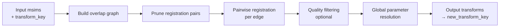
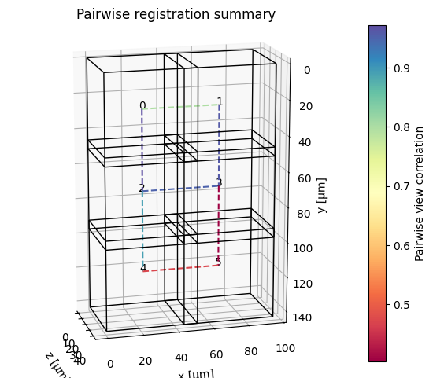
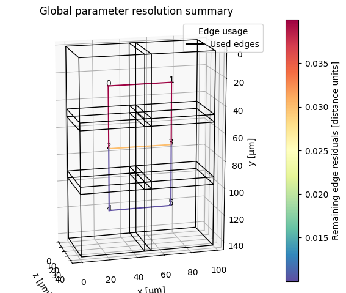

# Registration overview

Registration aligns all views / tiles to a common physical coordinate system so they can subsequently be visualized or fused without misalignments or blurring. `registration.register` is the main entry point.

---

## High-level workflow



1. **Build overlap graph** — from tile bounding boxes in the starting coordinate system (`transform_key`). Edges connect tiles whose bounding boxes intersect (optionally extended by `overlap_tolerance`).
2. **Prune registration pairs** — remove redundant or diagonal edges before running the (expensive) pairwise registration step.
3. **Pairwise registration** — for each edge, crop the overlap region from both tiles and run a registration function to find the transform that aligns them.
4. **Quality filtering** — optionally discard edges whose cross-correlation quality is below a threshold.
5. **Global parameter resolution** — find a globally consistent set of transforms from the noisy pairwise estimates (least-squares-style optimization or shortest-paths chaining).
6. **Write transforms** — attach the result as a new `transform_key` to every input `msim`.

---

## Minimal example

```python
from dask.diagnostics import ProgressBar
from multiview_stitcher import registration

with ProgressBar():
    params = registration.register(
        msims,
        reg_channel="DAPI",
        transform_key="stage_metadata",
        new_transform_key="translation_registered",
    )
```

`params` is a list of `xr.DataArray` transforms — one per view — mapping each view into the new coordinate system. The same transforms are also attached to the input `msims` under `new_transform_key`.

---

## Key parameters

| Parameter | Default | Description |
|-----------|---------|-------------|
| `msims` | — | List of `MultiscaleSpatialImage` inputs |
| `transform_key` | `None` | Starting coordinate system (e.g. `"stage_metadata"`) |
| `new_transform_key` | `None` | Name for the output coordinate system. If `None`, transforms are returned but **not** written back to the `msims`. |
| `reg_channel` | `None` | Channel name to use for registration (takes priority over `reg_channel_index`) |
| `reg_channel_index` | `None` | Channel index to use for registration |
| `registration_binning` | `None` | Spatial binning applied during registration, e.g. `{"z": 2, "y": 4, "x": 4}`. Auto-set when omitted. |
| `reg_res_level` | `None` | Resolution pyramid level to use (0 = full res). Auto-determined when omitted. |
| `overlap_tolerance` | `0.0` | Extend the considered overlap region by this amount in physical units. Use `None` to use the full tile extent. |
| `pairwise_reg_func` | `phase_correlation_registration` | Registration function for each tile pair. |
| `pairwise_reg_func_kwargs` | `None` | Extra arguments forwarded to `pairwise_reg_func`. |
| `groupwise_resolution_method` | `"global_optimization"` | How pairwise results are combined into global transforms. |
| `groupwise_resolution_kwargs` | `None` | Extra arguments for the resolution method (e.g. `{"transform": "rigid"}`). |
| `pre_registration_pruning_method` | `"alternating_pattern"` | Which edges to register (see below). |
| `post_registration_do_quality_filter` | `False` | Whether to remove low-quality edges after pairwise registration. |
| `post_registration_quality_threshold` | `0.2` | Spearman correlation threshold for quality filtering. |
| `plot_summary` | `False` | Plot cross-correlation values and per-edge residuals after registration. |
| `n_parallel_pairwise_regs` | `None` | Limit concurrent pairwise registrations (useful to cap memory). |
| `return_dict` | `False` | If `True`, return a dict with params, quality metrics, plots, and the registration graph. |

---

## Registration functions

`pairwise_reg_func` controls the algorithm used for each tile pair.

| Function | Best for |
|----------|----------|
| `phase_correlation_registration` (default) | Fast, translation-only; robust for most tiled acquisitions |
| `registration_ANTsPy` | Rigid / affine alignment; multi-modal data; requires `antspyx` |
| `registration_ITKElastix` | Rigid / affine alignment; flexible metrics; requires `itk-elastix` |

See [Built-in pairwise registration methods](built_in_methods_pairwise_registration.md) for full parameter reference and [Pairwise registration extension API](extension_api_pairwise_registration.md) to plug in a custom function.

---

## Pre-registration pruning

The overlap graph typically contains many redundant edges (e.g. diagonal neighbours in a grid). Pruning removes these before registration to save compute time.

| Method | When to use |
|--------|-------------|
| `"alternating_pattern"` (default) | Regular 2-D grid layouts — keeps a checkerboard subset of edges |
| `"otsu_threshold_on_overlap"` | Regular 2-D or 3-D grids — automatically prunes low-overlap diagonals |
| `"keep_axis_aligned"` | Explicitly remove diagonal pairs regardless of layout |
| `"shortest_paths_overlap_weighted"` | Irregular tile arrangements — minimises number of pairs while maintaining connectivity |
| `None` | Irregular arrangements with no obvious structure; registers all overlapping pairs |

---

## Global parameter resolution

After pairwise registration, `groupwise_resolution_method` resolves a globally consistent set of transforms. The default is `"global_optimization"` (least-squares, supports translation through affine); alternatives are `"linear_two_pass"` (faster, translation/rigid) and `"shortest_paths"` (deterministic chain, fastest). Control the output transform type via `groupwise_resolution_kwargs={"transform": "rigid"}` (or `"affine"`, etc.).

See [Built-in global parameter resolution methods](built_in_methods_global_param_resolution.md) for full details on each method and its options.

---

## Using higher-order transforms

For rigid, similarity, or affine registration, set both the pairwise function **and** the global resolution transform type:

```python
from multiview_stitcher import registration

params = registration.register(
    msims,
    reg_channel="DAPI",
    transform_key="stage_metadata",
    new_transform_key="affine_registered",
    pairwise_reg_func=registration.registration_ITKElastix,
    pairwise_reg_func_kwargs={"transform_types": ["Translation", "Rigid"]},
    groupwise_resolution_kwargs={"transform": "rigid"},
)
```

---

## Getting registration diagnostics

Pass `plot_summary=True` to show the following summary plots (in a Jupyter Notebook):

1) Pairwise image registration quality



Colors indicate the registration quality as reported by the pairwise registration function (e.g. cross-correlation in the case of `registration.phase_correlation_registration`).

2) Residual misalignment after global parameter resolution



Here, two types of information are shown:

- Colors indicate the residual misalignment after global parameter resolution, measured as the mean remaining distance between virtual fiducial markers placed on the corners of overlap regions between connected tiles.
- Dotted lines indicate edges that were removed by the global parameter resolution step (e.g. due to low quality or being part of a loop with high residuals).


Pass `return_dict=True` to access quality metrics in a dictionary:

```python
result = registration.register(
    msims,
    reg_channel="DAPI",
    transform_key="stage_metadata",
    new_transform_key="translation_registered",
    plot_summary=True,
    return_dict=True,
)

params   = result["params"]
qualities = result["pairwise_registration"]["metrics"]["qualities"]
residuals = result["groupwise_resolution"]["metrics"]["edge_residuals"]
```

!!! tip
    See [Registration quality metrics](registration_metrics.md) for comparing pairwise image similarity metrics under different transform keys.


---

## Memory and parallelism

- Pairwise registrations run in parallel by default (via Dask). Limit concurrency with `n_parallel_pairwise_regs` to reduce peak memory.
- Control the Dask scheduler via a context manager — not the deprecated `scheduler=` argument:

```python
import dask
with dask.config.set(scheduler="threads"):
    params = registration.register(msims, ...)
```

---

## Next steps

- **Fuse the registered tiles** → [Fusion overview](fusion_overview.md)
- **Troubleshoot registration problems** → [Registration troubleshooting](troubleshoot_registration_accuracy.md)
- **Extend with a custom registration function** → [Extension API: pairwise registration](extension_api_pairwise_registration.md)
