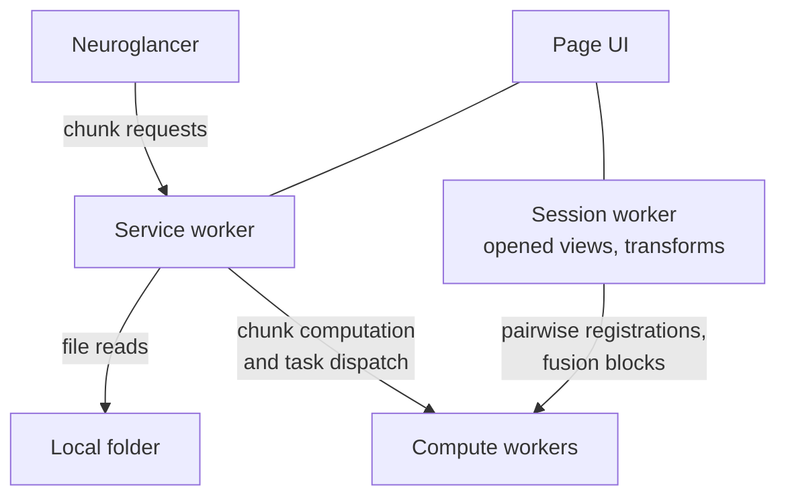

# Stitching in the browser

`multiview-stitcher` runs without installation in your browser, with
[Neuroglancer](https://github.com/google/neuroglancer) as the viewer.

<a class="md-button md-button--primary" href="../browser/" target="_blank" rel="noopener">
Open the browser app
</a>

<!-- A plain anchor with target=_blank: the app is a standalone page, not a
     documentation page, so Material's instant navigation must not try to
     swap it into the docs shell. -->

!!! note "Your data stays on your machine"
    The app is a static page. Nothing is uploaded: images are read directly
    from a folder you grant access to, and every computation runs in Python
    inside your browser.

## Try it out

1. Open the app in a Chromium-based browser (Chrome, Edge, Arc, Brave). It
   needs the [File System Access API](https://developer.mozilla.org/en-US/docs/Web/API/File_System_API),
   which Firefox and Safari do not implement yet.
2. Choose how many Python web workers to start.
3. Press **Load example** for a generated 3D 2&times;2 tile dataset, or drop your
   data onto the landing area:

    - a **folder** &mdash; either a single OME-Zarr, or a folder containing one
      OME-Zarr per tile. Several folders can be dropped together, in which case
      each one must itself be an OME-Zarr.
    - a **CZI file**, either a mosaic (tiles laid out in a plane) or a
      multi-view acquisition (stacks recorded at different angles). Which one
      it is is read from the file metadata, and either way one file is a whole
      dataset.

4. Press **Register**, then **Fuse (preview)**.

Dropping further folders or files *adds* their images to the views already
loaded, so a dataset can be assembled tile by tile from several places;
dropping the same folder twice changes nothing. Registration and fusion show their progress in
the header, and the compute workers start as soon as you pick how many to use
rather than on the first action. Each view has an individual remove button, and
**Clear** starts over. The viewer's layers always mirror the list, in the same
order and under the same names.

The `transform_key` menu switches which coordinate system the loaded sources
are shown in, e.g. from the positions stored in the file metadata
(`affine_metadata`) to the registration result (`registered`).

## How it works

The browser is treated as a second execution environment for the library
rather than a reimplementation: registration, fusion, transformations and
OME-Zarr handling are the same Python functions that run on the desktop,
executed by [Pyodide](https://pyodide.org/).



* A **service worker** gives everything one addressing scheme. It turns
  same-origin HTTP requests into reads from your local folder, into fused
  chunks computed in Python, or into work handed to the worker pool. This is
  also what lets synchronous Python block on asynchronous browser IO without
  `SharedArrayBuffer`, so no special COOP/COEP headers are needed.
* One **persistent session worker** owns the dataset: the opened views, the
  transform keys and the current state. Compute workers are stateless and
  rebuild an equivalent, read-only copy from a small JSON description of the
  session.
* Only metadata, user options, registration results and requested chunks cross
  the JavaScript boundary. Images are opened lazily and stay inside Python.
* The viewer is driven through its documented **viewer state** - the same JSON
  a Neuroglancer link carries - applied to the running instance. Switching
  `transform_key` therefore updates the view immediately: nothing reloads, and
  the camera, the WebGL context and everything already fetched survive.
* Input tiles are exposed to Neuroglancer as their **native OME-Zarr** where
  possible, with the selected `transform_key` attached as a Neuroglancer source
  transform. Their chunks are read straight from your folder by the service
  worker and never pass through Python. Anything the viewer cannot fetch on its own &mdash; the generated
  example, or any image that only exists in the Python heap &mdash; is exposed
  as a **virtual OME-Zarr** instead, so the viewer never needs to know the
  difference. The fused preview is always virtual: its chunks are fused on
  demand, spread over the worker pool.

### Reading a CZI

A CZI is one file rather than a directory of chunks, so it takes a different
route from an OME-Zarr: instead of being read over the service worker, it is
**mounted** into each Python worker's own filesystem, where it becomes an
ordinary path. The same functions used on the desktop then open it unchanged
&mdash; `io.read_mosaic_into_sims_czifile` for a mosaic, and
`czi_utils.read_multiview_czi_into_sims` for a multi-view acquisition, whose
views arrive with their rotations already applied from the metadata.

Which reader applies is decided by `czi_utils.is_multiview_czi`, from the
`MultiView` element of the metadata. The dimensions cannot decide it: a
multi-view file carries a mosaic dimension too, pinned at a single tile.

The mount is Emscripten's `WORKERFS`, which answers each read by slicing the
`File` and reading that slice synchronously. Only the bytes actually needed are
ever read, so a multi-gigabyte CZI is seeked through rather than loaded: opening
a mosaic touches its header and subblock directory, and each tile is decoded on
demand. Every worker mounts the file for itself, which is what lets a compute
worker open a tile knowing nothing but its URL.

### Cache invalidation

Every URL the viewer receives carries a session *generation*. Anything that
changes what those URLs should return &mdash; a new registration, a new fusion
&mdash; increments it, which retires the previous routes and hands Neuroglancer
URLs it has never seen. Requests for a retired route are answered with
"not found" rather than with data computed before the change.

## Fusion modes

| Mode | What happens |
| --- | --- |
| **Fuse (preview)** | A fused image is constructed lazily and opened in the viewer. Only the chunks you look at are ever computed, in parallel across the worker pool. |
| **Fuse to OME-Zarr** | The `fuse(..., output_zarr_url=...)` code path writes a multiscale OME-Zarr into a folder you choose. |

## Current limitations

- Chromium only, because of the File System Access API.
- Input is OME-Zarr, or **uncompressed** mosaic CZI. Compressed CZI (LZW, JPEG,
  JPEG XR, ZSTD) cannot be decoded in the browser: that needs
  [imagecodecs](https://pypi.org/project/imagecodecs/), a C extension with no
  WebAssembly build. Other formats, e.g. TIFF, are not available yet.
- Registration uses phase correlation and fusion uses weighted averaging;
  methods depending on packages without a WebAssembly build (ANTsPy,
  ITK-Elastix) are not available.
- Fusing **to disk** runs on the session worker rather than the pool: several
  workers writing into one mounted directory cannot be reconciled safely
  today. Preview fusion and registration do use the whole pool.
- Computation is single-threaded per worker; the parallelism comes from the
  number of workers you choose.

## Running it locally

```bash
uv run scripts/build_browser_app.py --neuroglancer --serve
# then open http://localhost:8000/browser/
```

`--serve` builds the app and then serves it on localhost until you interrupt
it. Rebuilding is what makes an edit visible, so this is one command rather
than two: the page addresses its own sources by a build id taken from their
contents, and a stale id is a change that does not appear.

The script needs nothing from the project itself, so `uv run` runs it in an
environment of its own instead of syncing everything first. Plain
`python scripts/build_browser_app.py --neuroglancer --serve` works the same
way, and the pieces are still separable:

```bash
python scripts/build_browser_app.py --neuroglancer   # build only
python -m http.server --directory docs 8000          # serve only
```

Serve `docs`, not `docs/browser`: the app is published under `/browser/` and
some of what it loads is addressed relative to that. It is offered on
localhost only - the service worker it reads data through and the File System
Access API it writes with both need a secure context, which plain HTTP is only
on localhost.

`--neuroglancer` bundles the viewer and is the only step that needs Node. If
npm is not on your `PATH`, point at it with `--npm /path/to/npm` or `MVS_NPM`.
Leave the flag off to rebuild just the wheel and keep the viewer bundle you
already have; `--check` reports whether it is complete.

The build step adds the two pieces that are not checked in: a wheel of the
current working tree (which the page installs into Pyodide) and a Neuroglancer
bundle, built from its npm package with esbuild (so this step needs Node).

The viewer is **embedded in the page**, not framed: `docs/browser/viewer.js`
imports Neuroglancer's public API and is the only module that knows anything
about it. It is still served from our own origin, because Neuroglancer starts
its Web Workers from those files and a worker cannot be created cross-origin.

Neuroglancer fetches a few assets by URL at run time - its worker bundles and
the WebAssembly decoders. Missing one shows up only when a user first opens an
image, so the build refuses to ship a bundle that does not carry every asset
its code references.

## Using the browser runtime from Python

The browser layer is an ordinary part of the package and works on CPython too,
which is how it is tested:

```python
from multiview_stitcher.browser import FusionOptions, RegistrationOptions, Session

session = Session()
session.load(["/data/tile_0.ome.zarr", "/data/tile_1.ome.zarr"])
session.register(RegistrationOptions(new_transform_key="registered"))

preview = session.fuse_preview(FusionOptions(transform_key="registered"))
kind, chunk = session.serve(preview["route"], "0/0/0/0/0")
```

## This is possible thanks to

- [Pyodide](https://pyodide.org/), a Python runtime for the browser
- [Neuroglancer](https://github.com/google/neuroglancer), a web-based viewer
  for large image datasets
- [OME-Zarr](https://ngff.openmicroscopy.org/), a chunked, cloud-native image
  format

## Jupyter in the browser

`multiview-stitcher` can also be used from a notebook in the browser:

- open [JupyterLite](https://jupyter.org/try-jupyter/lab/) in a private window
- upload [notebooks/stitching_in_the_browser.ipynb](https://github.com/multiview-stitcher/multiview-stitcher/tree/main/notebooks/stitching_in_the_browser.ipynb)
- upload the files to stitch into a `data` folder and follow the notebook
